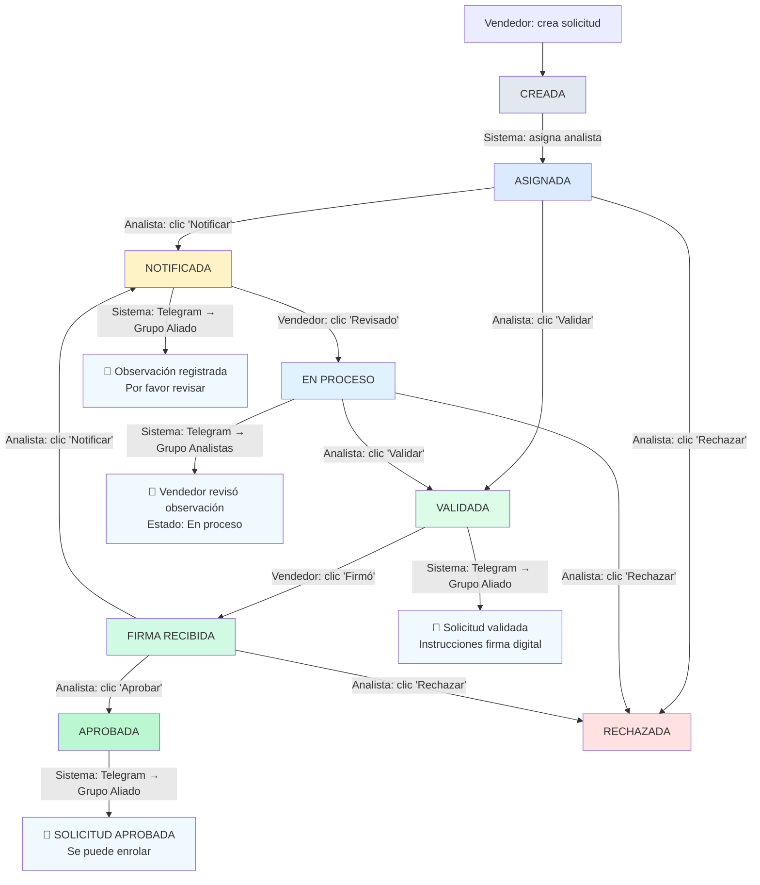

# Flujograma de Estados de Solicitud

## Actores
- **Vendedor** (crea solicitud, revisa observaciones, marca firma)
- **Analista** (asigna, notifica, valida, aprueba)
- **Sistema** (notificaciones automáticas por Telegram)

## Tabla Resumen

| # | Origen | Acción | Actor | Destino | Notificación Telegram |
|---|--------|--------|-------|---------|---------------------|
| 1 | — | Crear solicitud | Vendedor | `CREADA` | — |
| 2 | `CREADA` | Asignar analista automático | Sistema | `ASIGNADA` | — |
| 3 | `ASIGNADA` | Notificar observación | Analista | `NOTIFICADA` | Grupo **Aliado** |
| 4 | `ASIGNADA` | Validar directamente | Analista | `VALIDADA` | Grupo **Aliado** |
| 5 | `ASIGNADA` | Rechazar solicitud | Analista | `RECHAZADA` | Grupo **Aliado** |
| 6 | `NOTIFICADA` | Marcar como revisada | Vendedor | `EN_PROCESO` | Grupo **Analistas** |
| 7 | `EN_PROCESO` | Validar solicitud | Analista | `VALIDADA` | Grupo **Aliado** |
| 8 | `EN_PROCESO` | Rechazar solicitud | Analista | `RECHAZADA` | Grupo **Aliado** |
| 9 | `VALIDADA` | Marcar firma recibida | Vendedor | `FIRMA_RECIBIDA` | — |
| 10 | `FIRMA_RECIBIDA` | Notificar observación de firma | Analista | `NOTIFICADA` | Grupo **Aliado** |
| 11 | `FIRMA_RECIBIDA` | Aprobar solicitud | Analista | `APROBADA` | Grupo **Aliado** |
| 12 | `FIRMA_RECIBIDA` | Rechazar solicitud | Analista | `RECHAZADA` | Grupo **Aliado** |
